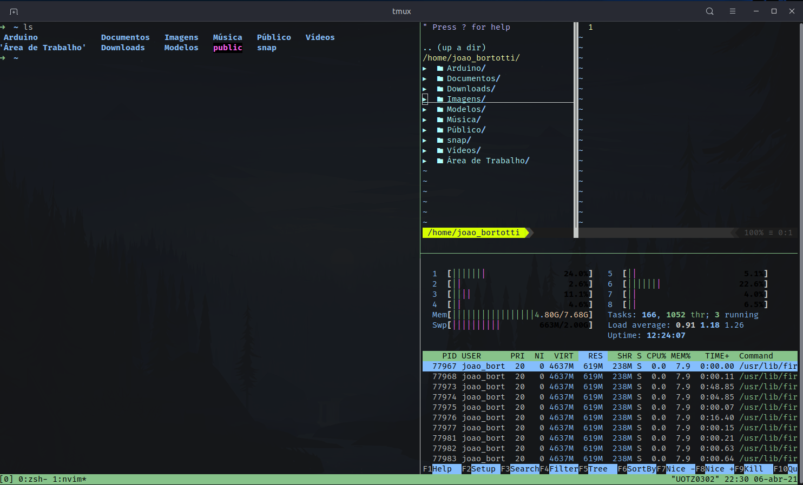

## My Dotfiles and other configs for development

#### Tools that i use:
* [Tmux](https://github.com/tmux/tmux/wiki)
* [Oh my Zsh](https://github.com/ohmyzsh/ohmyzsh)
* [NeoVim](https://github.com/neovim/neovim)

### Configs 
#### * Tmux
Any special or custom config, just use it for multiplex my terminal an be more efficient

#### * Oh My Zsh
Here we have some custom configs and addons

* [Maycoll/Gogh](https://github.com/Mayccoll/Gogh) 
> This project/repo allows you to download some custom terminal colors, wich i personally
prefer to use than Vim themes

* [Autosuggestions Plugin](https://github.com/zsh-users/zsh-autosuggestions)  
> This plugin will suggest commands as you type in your terminal, very useful :)

* [Robbyrussel](https://ohmyz.sh/)
> The default theme of Oh My Zsh, simple, but enough for me

* [Fonts Powerline](https://github.com/powerline/fonts)
> This fonts is useb by some plugins, useful for things like airlines or some icons

* [Nerd Font](https://github.com/ryanoasis/nerd-fonts)
> I like to use Fira code regular 11, since VSCode, is a simples/pretty/with-ligatures font

#### * NeoVim
My text editor, i use some plugins and configs to make it my primary editor/ide

* [Vim Plug](https://github.com/junegunn/vim-plug)
> Vim plugin manager to manage and download plugins, very easy to use, nice to manage plugins

* [Nerdtree](https://github.com/preservim/nerdtree)
> File system explorer for Vim, very nicely to bigger projects, switch to different
files faster

* [Airline](https://github.com/vim-airline/vim-airline)
> Status line with some useful information, like branch, filetype, enconde, end more custom stuff

* [Fugitive](https://github.com/tpope/vim-fugitive)
> Plugin for Git, have a nice integration with airline, to display branch on the status line

* [Tabnine](https://www.tabnine.com/install/vim)
> AI based autocompletion plugin, i'm just trying this, and it works fine for text and code editing

* [Editorconfig](https://github.com/editorconfig/editorconfig-vim)
> Editorconfig for Vim, same editorconf, but for vim :)
